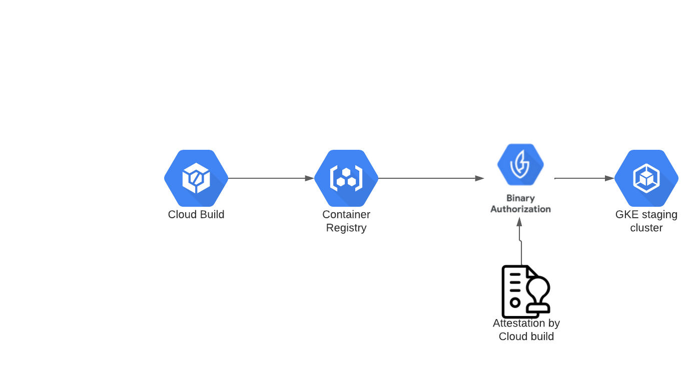
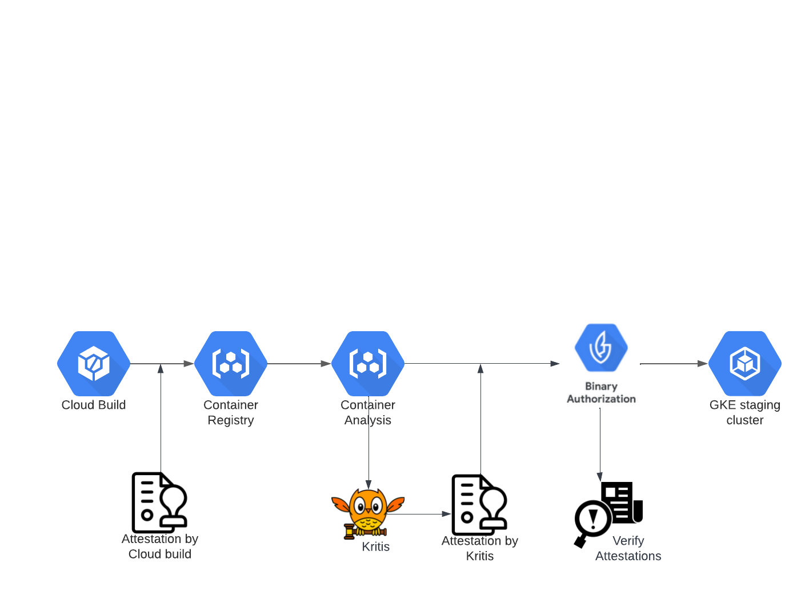
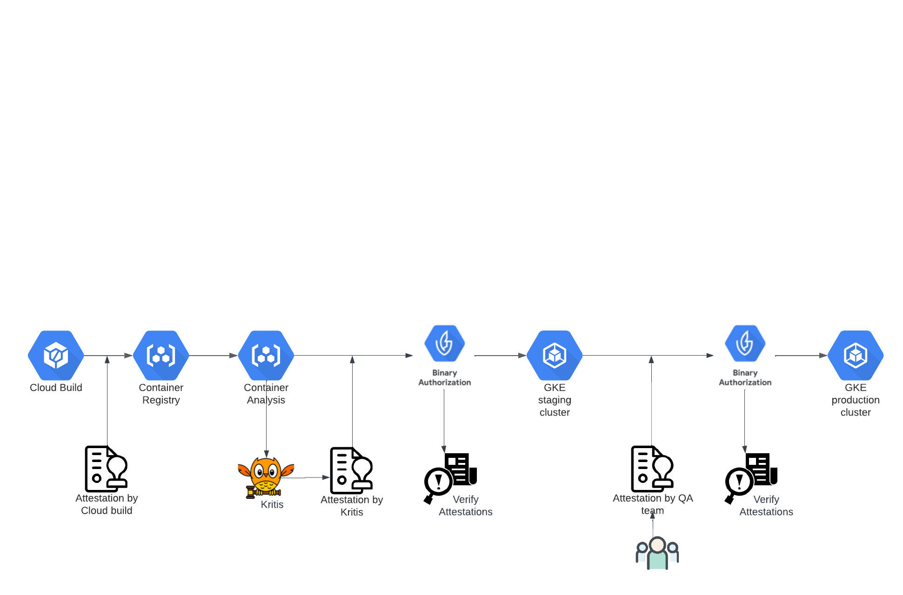

* [1. Stage-1: Binary authorization demo wiith a simple policy and cloud build](#1-stage-1-binary-authorization-demo-wiith-a-simple-policy-and-cloud-build)
* [2. Stage-2: Kritis Demo](#2-stage-2-kritis-demo)
* [3. Stage-3: Pipeline with Staging and production deployments](#3-stage-3-pipeline-with-staging-and-production-deployments)
  * [!](#)
* [4. References](#4-references)
---
This repo contains the code for running the demo's written on https://josephcloudnotes.wordpress.com/

---
# 1. Stage-1: Binary authorization demo wiith a simple policy and cloud build
In this stage, we will deploy the app to staging by cerifying the attestation from cloud build.

# 2. Stage-2: Kritis Demo
In this stage, we will deploy the app to staging cluster by verifying the attestations from cloud build and kritis (CVE based vulnarability scan results)

# 3. Stage-3: Pipeline with Staging and production deployments
In ths stage, will deploy the app to staging clsuter and then await QA attestation to deploy to production where ALL the attestrations will be verified. 

---
# 4. References
* [Binary Authorization](https://cloud.google.com/binary-authorization/docs/set-up-platform)
* [Cloud build attestor](https://cloud.google.com/binary-authorization/docs/deploy-cloud-build)
* [Kritis GIT repo](https://github.com/grafeas/kritis)